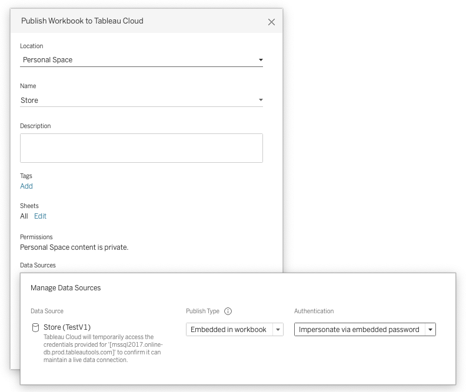

**In this section**

* TOC
{:toc}

## Overview
The authentication mode influences how and when a user is prompted to enter data source credentials. The primary scenarios where authentication occurs:

- Creating a connection with the connection dialog
- Opening a workbook and reconnecting to the data source
- Publishing a workbook or data source to Tableau Server

A combination of Connection Dialog and Connection Resolver changes implements each of these modes.

## Supported Authentication Modes

| Name | value | Description |
| - | - | - |
| No Authentication | `auth-none` | User is never prompted for credentials |
| Username only | `auth-user` | User is prompted for username during initial connection creation. |
| Username and Password | `auth-user-pass` | User is prompted for username and password during initial connection creation, and password only when reconnecting to the data source |
| Password only | `auth-pass` | User is prompted for password during initial connection creation and reconnecting to the data source |
| OAuth | `oauth` | User is prompted with the default brower for [OAuth]({{ site.baseurl }}/docs/oauth) credentials during initial connection creation and reconnecting to the data source |
| Integrated | `auth-integrated` | User is not prompted for credentials and relies on driver supported SSO like Kerberos: [details](https://github.com/tableau/connector-plugin-sdk/tree/master/samples/scenarios/jdbc_kerberos) |

The ```authentication``` attribute in a Tableau workbook (twb) or Tableau data source (tds) file contains the ```value``` defined above.

The specific usage patterns of these values can be found on the individual Connection Dialog pages:

- [Connection Dialog v1]({{ site.baseurl }}/docs/ui#supported-authentication-modes)
- [Connection Dialog v2]({{ site.baseurl }}/docs/mcd#authentication)


### Multiple Authentication Modes

User is prompted for which authentication option to use and conditionally shown additional fields.  Depending on the option selected, the user may or may not be prompted for credentials when reconnecting to the data source.

These are the relevant segments from the [sample](https://github.com/tableau/connector-plugin-sdk/tree/master/samples/scenarios/multi_auth) that implements multiple authentication modes.

```xml
<!-- Connection Dialog v2 -->
<connection-fields>
  ...
  <field name="authentication" label="Authentication" category="authentication" value-type="selection" default-value="auth-user-pass" >
    <selection-group>
      <option value="auth-none" label="No Authentication"/>
      <option value="auth-user" label="Username"/>
      <option value="auth-user-pass" label="Username and Password"/>
    </selection-group>
  </field>
  <field name="username" label="Username" category="authentication" value-type="string">
    <conditions>
      <condition field="authentication" value="auth-user"/>
      <condition field="authentication" value="auth-user-pass"/>
    </conditions>
  </field>
   <field name="password" label="Password" category="authentication" value-type="string" secure="true">
    <conditions>
      <condition field="authentication" value="auth-user-pass"/>
    </conditions>
  </field>
  ...
</connection-fields>
```

```xml
<!-- Connection Resolver -->
<tdr class='sample'>
    <connection-resolver>
        ...
        <connection-normalizer>
            <required-attributes>
                <attribute-list>
                    ...
                    <attr>authentication</attr>
                    <attr>username</attr>
                    <attr>password</attr>
                    ...
                </attribute-list>
            </required-attributes>
        </connection-normalizer>
    </connection-resolver>
    ...
</tdr>
```

```javascript
// Connection Builder (ODBC) or Properties Builder (JDBC)
{
    ...
    var authAttrValue = attr[connectionHelper.attributeAuthentication];
    if (authAttrValue == "auth-none")
        // no-op
    else if (authAttrValue == "auth-user")
        params["UID"] = attr[connectionHelper.attributeUsername];
    else if (authAttrValue == "auth-user-pass")
    {
        params["UID"] = attr[connectionHelper.attributeUsername];
        params["PWD"] = attr[connectionHelper.attributePassword];
    }

    ...
})
```

## Database Impersonation
On Tableau Server or Cloud, you can delegate the identity of the viewer using database impersonation. This only works when a connection is first published from Tableau Desktop with impersonation. It does not yet work with create datasource on the web. Only if the connection is marked for impersonation will the identity of the viewer be passed to the connection builders. This is because those connections must be marked as user specific. 



To show the impersonate option in the publish dialog you must have enabled CAP_AUTH_DB_IMPERSONATE in the plugin manifest.xml.
 ```xml
    <customizations>
      <customization name="CAP_AUTH_DB_IMPERSONATE" value="yes"/>
    </customizations>
 ```

There are two types of database impersonation, see sections below for details.
- Impersonation using embedded credentials
- Impersonation using integrated authentication


See community [article](https://community.tableau.com/docs/DOC-11137) for more information on impersonation.

### Database Impersonation Using Embedded Credentials
For impersonation with embedded credentials, the username and password should be for a service account with permission to delegate/impersonate other users.  The example below uses the driver property `DelegationUID` to pass the viewers identity through. Consult your driver documentation for the correct property name. 


 ```javascript
    // Connection properties
    function isEmpty(str) {
        return (!str || 0 === str.length);
    }

    var props = {};
    props["UID"] = attr[connectionHelper.attributeUsername];
    props["PWD"] = attr[connectionHelper.attributePassword];

    if (attr[connectionHelper.attributeTableauServerAuthMode] == connectionHelper.valueAuthModeDBImpersonate) {
        var str = attr[connectionHelper.attributeTableauServerUser];

        if (!isEmpty(str)){
            props["DelegationUID"] = str;
        }
    }
 ```

 A [sample](https://github.com/tableau/connector-plugin-sdk/tree/master/samples/scenarios/templates/db_impersonation) JDBC plugin is provided using an Impala database as an example. For documentation on how to configure delegation in Impala, refer to database [documentation](https://impala.apache.org/docs/build/html/topics/impala_delegation.html).

### Database Impersonation Using Integrated Authentication
Integrated authentication in the context of Tableau usually means Kerberos. We will authenticate using the Tableau Kerberos "RunAs" account, and then send the user identity to the database using the driver properties similar to the embedded credentials example above.

We also support [Kerberos constrained delegation](https://help.tableau.com/current/server/en-us/kerberos_delegation.htm), but that relies on delegation features of the Kerberos prototocol itself. This is not considered "database impersonation."

For on-premise Tableau Server, integrated authentication can be configured to mean other authentication methods transparent to Tableau, such as X509 certificate/private keys installed on the host. To enable this add an authentication option like below, and run the following TSM commands.

 ```xml
<field name="authentication" label="Authentication" category="authentication" value-type="selection">
  <selection-group>
    <option value="auth-integrated" label="x509" />
  </selection-group>
</field>
```

```sh
tsm configuration set -k native_api.UseKerberosForRunasDbImpersonation -v false
tsm pending-changes apply
```

## Considerations for 'hadoophive' and 'spark' base classes

When using 'hadoophive' or 'spark' as a base class there are additional constraints and requirements in the Connection Dialog and Connection Resolver.

In the Connection Dialog, any authentication ```option``` elements used must match the following definition.

```xml
<!-- Connection Dialog V1 -->

<!-- <authentication-options> -->
<option name="None" value="0" />
<option name="Username" value="2" />
<option name="UsernameAndPassword" value="3" />
<!-- </authentication-options> -->
```

The Connection Resolver needs to include the additional required attribute ```authentication-type```.
```xml
<!-- Connection Resolver -->
<tdr class='sample'>
    <connection-resolver>
        ...
        <connection-normalizer>
            <required-attributes>
                <attribute-list>
                    ...
                    <attr>authentication</attr>
                    <attr>authentication-type</attr>
                    <attr>username</attr>
                    <attr>password</attr>
                    ...
                </attribute-list>
            </required-attributes>
        </connection-normalizer>
    </connection-resolver>
    ...
</tdr>
```
