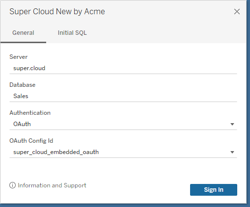
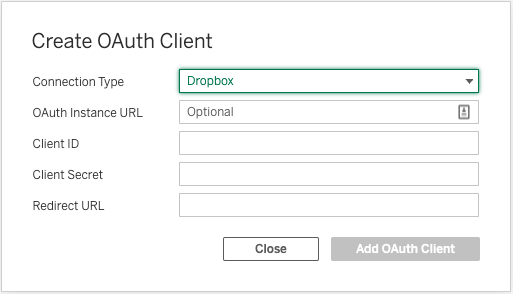
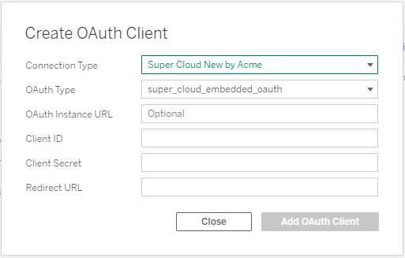
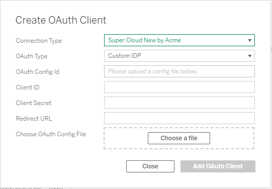
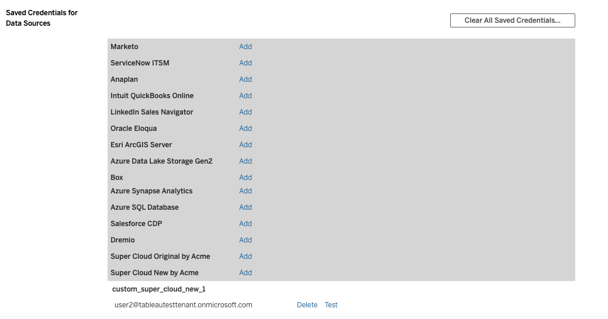

OAuth for plugins is available in Tableau 2021.1 and newer. Multi-IDP config for plugins is available starting in Tableau 2023.1.

This document explains how to configure and use OAuth. It's meant for admins and plugin developers. For information on adding OAuth to a connector plugin, see [OAuth Development](./oauth-dev.md).

We have templates for common IDPs in the [samples](https://github.com/tableau/connector-plugin-sdk/tree/master/samples/components/oauth). In general, you should only need to substitute the desktop client ID and secret, and the URL of the IDP. However, there may be additional modifications needed to account for differences such as with PKCE and scopes.

**In this section**

* TOC
{:toc}

# The OAuth Config File

This file configures a connector to run OAuth flows against a particular IDP. The XML schema is defined here: [XSD](https://github.com/tableau/connector-plugin-sdk/blob/master/validation/oauth_config.xsd).

This file may be provided in the following ways:
- Bundled in the connector package (only available to plugin authors)
- Installing on a client machine for Tableau Desktop, Prep, or Bridge. See [Custom OAuth Config on Desktop](./oauth.md#custom-oauth-configs-on-desktop)
- Installing for a site on Tableau Cloud or Tableau Server. [Create Site OAuth Client](./oauth.md#create-site-oauth-client-20231)

We refer to the first option as an "Embedded" config, and the second two as "Custom." The latter two options are only available starting in Tableau 2023.1. Also before 2023.1 you can only embed a single OAuth Config.

## XML Elements

`<pluginOAuthConfig>` is the parent element for all fields below.

| Name  | Type | Meaning | Required | Notes |
| ----  | ------- | --------- | ----------- | ----------- |
| dbclass | String | The connector class which this OAuth config applies to. | Yes | The dbclass must be same with as the `class` attribute in manifest.xml |
| oauthConfigId | String | Unique ID for this OAuth config | Recommended | *New in Tableau 2023.1.* This is a required attribute if there are multiple OAuth configs defined for a connector. **When using an custom config this must begin with the prefix "custom_".** |
| configLabel | String | Label that is used as a display to users in place of the oauthConfigId. | No | *New in Tableau 2023.2.* This must only contain alphanumeric characters, "_", "-", and spaces in order to be considered valid. |
| clientIdDesktop | String | Client ID you registered for Tableau Desktop | No | This is not considered a secret and will be stored in plain text |
| clientSecretDesktop | String | Client Secret you registered for Tableau Desktop | Recommended | This is not considered a secret and will be stored in plain text |
| redirectUrisDesktop | String[] | Redirect Urls for Desktop | No | Only required when `OAUTH_CAP_FIXED_PORT_IN_CALLBACK_URL` is set to true. This will configure the URL for the authorization response browser redirect. See [redirectUrisDesktop Format](#redirecturisdesktop-format) below for the URL format. This element can be specified multiple times, one for each port. Example: http://localhost:55557/Callback |
| authUri | String | Authorization endpoint URI | Yes | If OAUTH_CAP_SUPPORTS_CUSTOM_DOMAIN is set this is a relative path to the instance URL like `/oauth2/v2.0/authorize` |
| tokenUri | String | Token endpoint URI | Yes | If OAUTH_CAP_SUPPORTS_CUSTOM_DOMAIN is set this is a relative path to the instance URL like `/oauth2/v2.0/token` |
| userInfoUri | String | User Info UrI | No | If OAUTH_CAP_SUPPORTS_CUSTOM_DOMAIN is set this is a relative path to the instance URL like `/oauth2/v2.0/userinfo` |
| instanceUrlSuffix | String | Instance URL Suffix | No | If OAUTH_CAP_INFER_INSTANCE_URL_FROM_SERVER is set to true, this will be concatenated with the user-provided server field like `https://{SERVER}{instanceUrlSuffix}`. Otherwise, ignored. |
| instanceUrlValidationRegex | String | Use to validate against your OAuth instance Url. | No | Uses [Java regex pattern](https://docs.oracle.com/en/java/javase/11/docs/api/index.html) syntax, which is similar to PCRE. Example: `^https://(.+\\.)?(myidp.com\\.(com\|us\|cn\|de))(.*)` |
| defaultInstanceUrl | String | Instance URL that can be used when the user does not provide one on the client side. | No | OAUTH_CAP_SUPPORTS_CUSTOM_DOMAIN must be set to true in order to be consumed. Otherwise, ignored. |
| scopes | String[] | scopes | Yes | |
| capabilities |  Map<String, Bool>  | Customizes the OAuth flow | No | See [OAuth Capabilies](#oauth-capabilities) below for details. |
| accessTokenResponseMaps |  Map<String, String> | Key value pair that maps an initial token request response attribute <value> to Tableau recognized attribute <key> | Yes | See table below for more info. |
| refreshTokenResponseMaps | Map<String, String> | Key value pair that maps a refresh token request response attribute <value> to Tableau recognized attribute <key> | No | If not defined will use accessTokenResponseMaps by default |

<br>

## Response Attribute Mapping
The XML elements *accessTokenResponseMaps* and *refreshTokenResponseMaps* define a relationship between Tableau field names to fields in the authorization server response. For example this maps Tableau's `ACCESSTOKEN` field to `access_token` in the authorization server response.

```
    <entry>
        <key>ACCESSTOKEN</key>
        <value>access_token</value>
    </entry>
```

| Tableau Name | Required for accessTokenResponseMaps | Required for refreshTokenResponseMaps | Notes |
| ----  | ------- | --------- |  ----------- |
| ACCESSTOKEN | Yes | Yes | Access token. Short lived. |
| REFRESHTOKEN | Yes | No | Refresh token. Long lived. Used to refresh access token. |
| username | Yes | No | Used by Tableau to identify the token. |
| access-token-issue-time | No | No | Defaults to the time when the token is sent to Tableau |
| access-token-expires-in | No | No | Default 3600 seconds |
| id-token | No | No | If you have openid as your scope this field is returned and can be used to retrive userinfo. Use together with OAUTH_CAP_SUPPORTS_GET_USERINFO_FROM_ID_TOKEN |
| [your own field] | No | No | It is usually not needed to define your own field, and this field will not be able to participate in any OAuth flow. |

<br>

## OAuth Capabilities

This set of OAuth Config capabilities is not shared with the regular connector capabilities.

| Capability Name  | Description | Default | Recommendation |
| ----  | ------- | --------- | ----------- |
| OAUTH_CAP_SUPPORTS_CUSTOM_DOMAIN | Enable this if your IDP has different URLs. The OAuth config will specify the relative paths for the URLs, and the end user will have to provide the IDP hostname when creating a new connection. **OAUTH_CAP_SUPPORTS_CUSTOM_DOMAIN only works for embedded OAuth config.** See [Instance URL/Custom Domain](./oauth-dev.md#instance-urlcustom-domain) for more information. | false | - |
| OAUTH_CAP_REQUIRE_PKCE | Whether your OAuth provider supports PKCE, more details: https://oauth.net/2/pkce/ | false | true |
| OAUTH_CAP_PKCE_REQUIRES_CODE_CHALLENGE_METHOD | Whether your OAuth provider PKCE requires code_challenging_method passed in. If set to true, we are using S256 by default. | false | true |
| OAUTH_CAP_SUPPORTS_STATE | Used to protect against CSRF attacks, more details: https://auth0.com/docs/protocols/state-parameters | false | true |
| OAUTH_CAP_GET_USERNAME_USES_POST_REQUEST | Only use if you define a USERINFO_URI in oauthConfig file to retrieve the userinfo in a separate request | false | - |
| OAUTH_CAP_CLIENT_SECRET_IN_URL_QUERY_PARAM | Use this if Client secrets are expected in the query parameter instead of the request header. | false | - |
| OAUTH_CAP_FIXED_PORT_IN_CALLBACK_URL | Only relevant for desktop apps (Tableau Desktop and Prep). Use this when your authorization server doesn't allow dynamic port ranges for localhost/native apps. | false | - |
| OAUTH_CAP_SUPPORTS_HTTP_SCHEME_LOOPBACK_REDIRECT_URLS | Starting in Tableau 2023.1, You can use any valid loopback address like http://localhost:[portnumber]/Callback, http://127.0.0.1:[portnumber]/Callback(IPv4), http://[::1]:[portnumber]/Callback(IPv6). If you use loopback address other than localhost, enable OAUTH_CAP_SUPPORTS_HTTP_SCHEME_LOOPBACK_REDIRECT_URLS as well. For more info see https://developers.google.com/identity/protocols/oauth2/native-app | false | - |
| OAUTH_CAP_REQUIRES_PROMPT_CONSENT | Add prompt=consent to the request. | false | - |
| OAUTH_CAP_REQUIRES_PROMPT_SELECT_ACCOUNT | Add prompt=select_account to the request. More details: https://docs.microsoft.com/en-us/azure/active-directory/develop/v2-oauth2-auth-code-flow | false | - |
| OAUTH_CAP_SUPPORTS_GET_USERINFO_FROM_ID_TOKEN | Used when your OAuth response contains a JWT style ID_TOKEN that can be parsed out to get actual username. For example, https://docs.microsoft.com/en-us/azure/active-directory/develop/id-tokens | false | - |
| OAUTH_CAP_INFER_INSTANCE_URL_FROM_SERVER | Used to concatenate the user-provided server with the `instanceUrlSuffix` field in the format of `https://{SERVER}{instanceUrlSuffix}`. | false | - |

---
## Example OAuthConfig File
**oauthConfig.xml**

```xml
<?xml version="1.0" encoding="utf-8"?>
<pluginOAuthConfig>
    <!-- dbclass must correspond to the class registered in manifest.xml -->
    <dbclass>my-connector-class</dbclass>

    <clientIdDesktop>client-id-1234</clientIdDesktop>
    <clientSecretDesktop>xyz-456-000</clientSecretDesktop>

    <!-- Desktop redirectUri, only needed if your authorization server doesn't allow dynamic port ranges in localhost redirect. -->
    <redirectUrisDesktop>http://localhost:55556/Callback</redirectUrisDesktop>
    <redirectUrisDesktop>http://localhost:55557/Callback</redirectUrisDesktop>
    <redirectUrisDesktop>http://localhost:55558/Callback</redirectUrisDesktop>
    <redirectUrisDesktop>http://localhost:55559/Callback</redirectUrisDesktop>
    <redirectUrisDesktop>http://localhost:555510/Callback</redirectUrisDesktop>

    <authUri>https://my.idp.com/oauth2/v1/authorize</authUri>
    <tokenUri>https://my.idp.com/oauth/token-request</tokenUri>

    <instanceUrlValidationRegex>^https:\/\/(.+\.)?(supercloud\.(com|us|cn|de))(.*)</instanceUrlValidationRegex>
    <scopes>refresh_token</scopes>
    <scopes>profile</scopes>
    <scopes>email</scopes>
    <capabilities>
        <entry>
            <key>OAUTH_CAP_PKCE_REQUIRES_CODE_CHALLENGE_METHOD</key>
            <value>true</value>
        </entry>
        <entry>
            <key>OAUTH_CAP_SUPPORTS_CUSTOM_DOMAIN</key>
            <value>true</value>
        </entry>
        <entry>
            <key>OAUTH_CAP_REQUIRE_PKCE</key>
            <value>true</value>
        </entry>
        <entry>
            <key>OAUTH_CAP_FIXED_PORT_IN_CALLBACK_URL</key>
            <value>true</value>
        </entry>
        <entry>
            <key>OAUTH_CAP_PKCE_REQUIRES_CODE_CHALLENGE_METHOD</key>
            <value>true</value>
        </entry>
    </capabilities>

    <!-- Map Tableau recognized attribute "key" to OAuth response attribute "value" -->
    <accessTokenResponseMaps>
        <entry>
            <key>ACCESSTOKEN</key>
            <value>access_token</value>
        </entry>
        <entry>
            <key>REFRESHTOKEN</key>
            <value>refresh_token</value>
        </entry>
        <entry>
            <key>access-token-issue-time</key>
            <value>issued_at</value>
        </entry>
        <entry>
            <key>access-token-expires-in</key>
            <value>expires_in</value>
        </entry>
        <entry>
            <key>username</key>
            <value>username</value>
        </entry>
    </accessTokenResponseMaps>

    <!-- No refreshTokenResponseMaps needed since it's the same as accessTokenResponseMaps -->
 </pluginOAuthConfig>
```

## Instance URL/Custom Domain
Some IDPs have a single global endpoint, such as https://accounts.google.com/o/oauth2/. Others have different instances, for example Okta would have a different instance URL for each customer. If your authorization server or IDP has different instances, then either:
- Enable OAUTH_CAP_SUPPORTS_CUSTOM_DOMAIN. This only works with embedded OAuth configs. The instance URL will be either be collected later from the end-user or be extracted via the embedded OAuth configs' `defaultInstanceUrl` field.
- Create seperate external/custom OAuth configs for each custom domain. External OAuth config shouldn't set OAUTH_CAP_SUPPORTS_CUSTOM_DOMAIN, and should specify authUri, tokenUri, userInfoUri fields as absolute paths, which contains the custom domain/instance URL.

## Multiple Embedded OAuth Configs
*\*Available starting in Tableau 2023.1*

The plugin developer may add multiple embedded OAuth configs to the plugin starting in Tableau 2023.1. Each should have a new element `<oauthConfigId>`. This should be unique and is displayed in the UI. The user will be prompted to select from the available configurations when creating a connection.



OAuth configs may also be specified independent of the plugin using site-level OAuth clients or by installing in the Tableau directory for desktop applications. See below for more information.

# OAuth on Tableau Desktop/Tableau Prep
Tableau Desktop uses a shared client ID and client secret which is embedded in the plugin. It also uses localhost callbacks to receive the authorization code response. The plugin developer (or whoever provides the OAuth config) must ensure that the localhost or loopback callback URLs are configured on the whitelist for the authorization server.

If the authorization server supports dynamic port ranges for native applications then that should be used. This is the default behavior for Tableau OAuth clients. If the authorization server does not support this, then enable OAUTH_CAP_FIXED_PORT_IN_CALLBACK_URL, and specify a set of `<redirectUrisDesktop>` in the OAuth config.

### redirectUrisDesktop Format
- Before Tableau 2023.1, the redirectUrisDesktop must be of the form `http://localhost:[portnumber]/Callback`. If you need to use loopback address other than localhost, you can enable OAUTH_CAP_SUPPORTS_HTTP_SCHEME_LOOPBACK_REDIRECT_URLS, but the `<redirectUrisDesktop>` should still specify localhost. The callback at runtime will be rewritten to something like http://127.0.0.1:55555/Callback.
- Starting in Tableau 2023.1, You can use any valid loopback address like `http://localhost:[portnumber]/Callback`, `http://127.0.0.1:[portnumber]/Callback` (IPv4), `http://[::1]:[portnumber]/Callback` (IPv6). If you use loopback address other than localhost, enable OAUTH_CAP_SUPPORTS_HTTP_SCHEME_LOOPBACK_REDIRECT_URLS as well.

For more information on see [RFC 8252: Loopback Interface Redirection](https://datatracker.ietf.org/doc/html/rfc8252#section-7.3).

## Custom OAuth Configs on Desktop
*Available starting in Tableau 2023.1*

The end user or admin can specify custom OAuth configs for desktop applications, independent of the plugin connector. These should be installed in the repository folder which corresponds to the application, such as `My Tableau Repository/OAuthConfigs` or `My Tableau Prep Repository/OAuthConfigs`. They must define the new field `oauthConfigId`. The user will be prompted to select from available configs when creating the connection.

When installing or testing custom OAuth configs on desktop, you must restart the application to pick up the changes.

# OAuth on Tableau Server & Tableau Online

## Server Level OAuth Clients
**This is an older approach that may not work for plugins with with multiple OAuth configs. In most cases [Site Level OAuth Clients](#site-level-oauth-clients) are preferred.**

You need to configure the OAuth client on server for all connectors using saved credentials (aka Custom OAuth), which includes all plugins. Execute the following command, substituting the values for your OAuth client. Note if you have multiple OAuth Configs, the oauth.config.id should be formatted as `dbClass:oauthConfigId`.

```
tsm configuration set -k oauth.config.clients -v "[{\"oauth.config.id\":\"[dbclass]\", \"oauth.config.client_id\":\"[client_id]\", \"oauth.config.client_secret\":\"[client_secret]\", \"oauth.config.redirect_uri\":\"[redirect_url]\"}]" --force-keys
```
The value `dbclass` should match that configured in the plugin manifest and OAuthConfig.xml. The `client_id`, `client_secret`, and `redirect_uri` should be provided by your authorization server. The `redirect_url` needs to follow certain format, if your Tableau Server URL is https://myserver/ then `redirect_uri` needs to be https://myserver/auth/add_oauth_token.


## Site Level OAuth Clients
The preferred way to configure OAuth on Tableau Cloud/Server is by using site level OAuth clients. These are configured by the server admin for Tableau Server, or site admin for Tableau Online. For an example of configuring an Azure AD OAuth client on a site: https://help.tableau.com/current/server/en-us/config_oauth_azure_ad.htm.

The site OAuth clients will only be effective for a particular site, and will not not require a restart. They will take take precedence over the server-level OAuth clients if any. For each site, there is only one OAuth client allowed for each OAuth config.

### Create Site OAuth Client (Pre 2023.1)


### Create Site OAuth Client (2023.1+)
Starting in Tableau 2023.1, you can have multiple OAuth configs for a connector. These may be embedded or custom.

To create a client for an embedded config, select the config ID.



<br>
To create a client for an custom config, upload the config XML file.



## Site-Wide OAuth Clients
Another way is through the site level OAuth client feature where the server admin for Tableau Server, or site admin for Tableau Online, will be able to register the OAuth client on a particular site. For example setting Azure AD OAuth client on a site: https://help.tableau.com/current/server/en-us/config_oauth_azure_ad.htm.
The OAuth clients will only be effective in the particular site, it did not require a restart and take precedence over the server-wide OAuth clients if any.

# Site vs Server OAuth Client

| Feature | Server-Wide OAuth Clients | Site-Wide OAuth Clients |
| ----  | ------- | --- |
| Configuration Mechanism | TSM command run by server admin | Web UI by  site admin (Tableau Online) or server admin (Tableau Server)|
| Restarts | Need restart server| No need to restart server|
| Availability |Apply to whole server| Only apply to the particular site, will not affect other sites|
| Precedence | - | Take precedence over server-level OAuth Clients if both exist |

## Saved Credentials
To add an OAuth credential on Tableau Server, go to **My Account Settings** page, look for your connector in the **Saved Credentials For DataSources** Section.
After successfully adding your credential you will notice an entry appear under your connector. In this case the OAuth config ID is shown along with the username. In some cases the instance-url may also be shown.



## Desktop Publish Flow

When publishing an OAuth connection to Tableau Server, you will see multiple auth options:
- **Prompt** means this resource will published without embedding credential, viewers would need to provide credential to access the resource.
- **Embedding [username]** means you will embed the credential to this resource, so all the viewer can use the same credential to access the resource. Note in order for this to show up, you must already have added a saved OAuth credential according to previous section. You would see multiple entries if you have multiple records of saved credentials and you can pick which one you want to use for embedding.
- **Embed Password** is not a supported auth mechanism for plugin OAuth connections and an error will show up if you choose that option.

## Tableau Server Web Authoring Flow

For Web Authoring, the UI dialog will be same as Tableau Desktop. The difference will be that we are using the server OAuth clients. The server or site admin must configure the OAuth client information (client ID, client secret, etc) beforehand for this to succeed.
