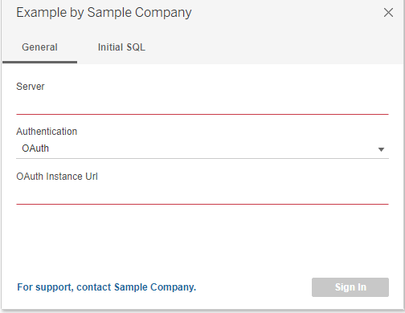
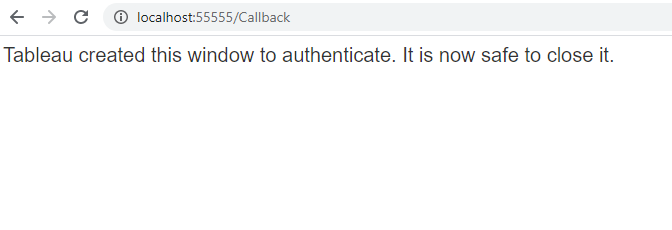
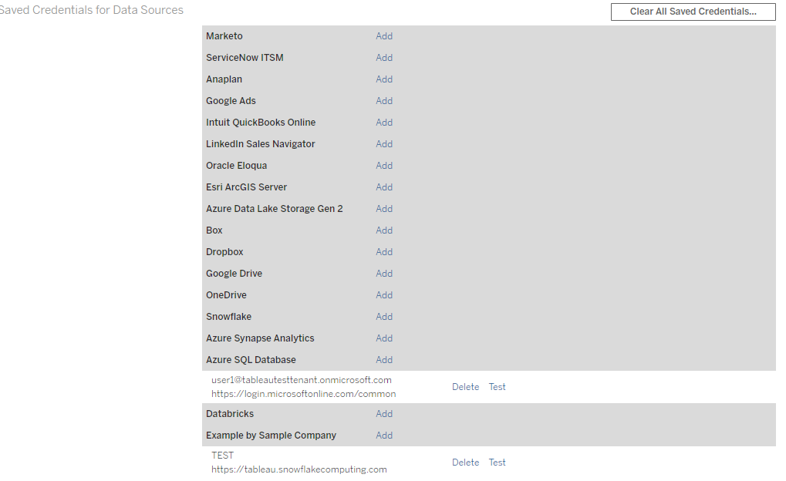
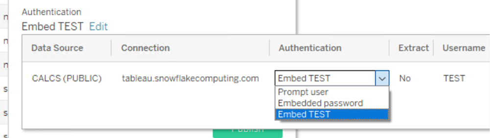

**IMPORTANT:** This feature is available in Tableau 2021.1 and newer. 

# How to enable OAuth for a plugin connector

First check your database and driver documentation to make sure it supports OAuth. For a complete example please refer to https://github.com/tableau/connector-plugin-sdk/tree/master/samples/scenarios/snowflake_oauth.

To enable OAuth for your connector add an `<oauth-config>` field in the manifest.xml and link to an oauthConfig.xml you created, described below. 

```xml
  manifest.xml

  <?xml version='1.0' encoding='utf-8' ?>

  <connector-plugin class=...>
    ...
    <dialect file='dialect.tdd'/>
    <oauth-config file='oauthConfig.xml'/>    <!-- add this to to define your OAuth Configs -->
  </connector-plugin>
```

In your connectionFields.xml file make sure add an `authentication` field with a value equal to `oauth`.

```xml
  connectionFields.xml Single Auth Type:

  <field name="authentication" label="Authentication" category="authentication" value-type="string" editable="false" default-value="oauth" />
```

```xml
  connectionFields.xml Multiple Auth Types:

  <field name="authentication" label="Authentication" category="authentication" value-type="selection" default-value="auth-user-pass" >
    <selection-group>
      <option value="auth-user-pass" label="Username and Password"/>
      <option value="oauth" label="OAuth"/>
    </selection-group>
  </field>
```

In your connectionBuilder.js file you need to use your DB sepcific logic to handle how to pass in OAuth attributes. Example:

```js
  connectionBuilder.js
  if(authAttrValue == "oauth")
  {
      params["AUTHENTICATOR"] = "OAUTH";
      params["TOKEN"] = attr["ACCESSTOKEN"];
  }
```
In your connectionResolver.tdr file, the following related OAuth attrs will be auto included so you do not need to define them:
```ACCESSTOKEN, REFRESHTOKEN, access-token-issue-time, access-token-expires-in, CLIENTID, CLIENTSECRET, oauth-client, id-token(if any), instanceurl(if any)```
You still need to define other required attributes for your connector, `authentication` and `username` are currently required for OAuth connections so make sure to add them as well.

```xml
<required-attributes>
    <attribute-list>
        <attr>server</attr>
        <attr>dbname</attr>
        <attr>sslmode</attr>
        <attr>authentication</attr>
        <attr>username</attr>
    </attribute-list>
</required-attributes>
```
# The OAuth Config File

The OAuth Config file defines your connector's OAuth configuration and also provide the ability to customize how the OAuth flow should work.

The OAuth Config file ([XSD](https://github.com/tableau/connector-plugin-sdk/blob/master/validation/oauth_config.xsd)) is indentified in the manifest using the `<oauth-config>` element. Here we discuss the structure of this file.

## XML Elements

### `<pluginOAuthConfig>`

This is the parent element for all fields.

### `Elements`

Each OAuth config attribute is represented by an element in the XML, the element name is the attribute name and the content is the attribute value.

| Name  | Type | Meaning | Required? | Notes |
| ----  | ------- | --------- | ----------- | ----------- |
| dbclass | String | The identifier for your oauthConfig | Yes | The dbclass must be same with as the `class` attribute in manifest.xml | 
| clientIdDesktop | String | Client ID you registered for Tableau Desktop | No | This is not considered a secret and will be stored in plain text | 
| clienSecretDesktop | String | Client Secret you registered for Tableau Desktop | No | This is not considered a secret and will be stored in plain text | 
| redirectUrisDesktop | String[] | Redirect Urls for Desktop | No	| The host for redirectUrisDesktop must be a valid loopback address| 
| authUri | String | Authorization endpoint URI | Yes | |
| tokenUri | String | Token endpoint URI | Yes | |
| userInfoUri | String | User Info UrI | No | |
| instanceUrlValidationRegex | String | Use to validate against your OAuth instance Url. | No | |
| scopes | String[] | scopes | Yes | |
| capabilities | Map<String, String> | This defines how OAuth flow behaves differently according the capabilities set. | No | |
| accessTokenResponseMaps | Map<String, String> | Key value pair that maps an initial token request response attribute <value> to Tableau recognized attribute <key> | Yes | |
| refreshTokenResponseMaps | Map<String, String> | Key value pair that maps an refresh token request response attribute <value> to Tableau recognized attribute <key> | No | If not defined will use accessTokenResponseMaps by default |

Note: The keys in accessTokenResponseMaps and refreshTokenResponseMaps are Tableau preferred field names and are defined in the followed table. The values are what your OAuth provider returns in the raw response
| Name of the key | Required for accessTokenResponseMaps | Required for refreshTokenResponseMaps | Notes |
| ----  | ------- | --------- |  ----------- |
| ACCESSTOKEN | Yes | Yes | Used by Tableau to connect to your data. |
| REFRESHTOKEN | Yes | No | Used by Tableau to get a new ACCESSTOKEN when the old one expired. |
| username | Yes | No | Used by Tableau to identify the token. |
| access-token-issue-time | No | No | Used to note when the token is issued, will default to the time when the token is sent back to Tableau if not set. |
| access-token-expires-in | No | No | Use to note the validation time of your ACCESSTOKEN, will default to 3600s if not set. |
| [your own field] | No | No | It is usually not needed to define your own field, and this field will not be able to participate in any oauth flow. |

<br>

## OAuth Capabilities

This set of OAuth Config capabilities are not shared with the regular connector capabilities.

| Capability Name  | Description | Default | Recommendation | 
| ----  | ------- | --------- | ----------- |
| OAUTH_CAP_SUPPORTS_CUSTOM_DOMAIN | Whether your OAuth provider supports custom domain. i.e. OAuth endpoint host is not fixed. | false | - |
| OAUTH_CAP_REQUIRE_PKCE | Whether your OAuth provider supports PKCE, more detials: https://oauth.net/2/pkce/ | false | true |
| OAUTH_CAP_PKCE_REQUIRES_CODE_CHALLENGE_METHOD | Whether your OAuth provider PKCE requires code_challenging_method passed in. If set to true, we are using S256 by default. | false | true |
| OAUTH_CAP_SUPPORTS_STATE | Used to protect against CSRF attacks, more details: https://auth0.com/docs/protocols/state-parameters | false | true |
| OAUTH_CAP_REQUIRES_VERIFY_STATE | Used together with OAUTH_CAP_SUPPORTS_STATE | false | true |
| OAUTH_CAP_GET_USERNAME_USES_POST_REQUEST | Only use if you define a USERINFO_URI in oauthConfig file to retrieve the userinfo in a separate request | false | - |
| OAUTH_CAP_CLIENT_SECRET_IN_URL_QUERY_PARAM | Use this if Client secrets are expected in the query parameter instead of the request header. | false | - |
| OAUTH_CAP_FIXED_PORT_IN_CALLBACK_URL | Use this when your OAuth provider native app(Tableau Desktop) OAuth clients only support fixed callback url | false | - |
| OAUTH_CAP_SUPPORTS_HTTP_SCHEME_LOOPBACK_REDIRECT_URLS | Use this when your OAuth provider native app(Tableau Desktop) OAuth clients support Loopback callback url. E.g. https://developers.google.com/identity/protocols/oauth2/native-app | false | - |
| OAUTH_CAP_REQUIRES_PROMPT_CONSENT | Add prompt=consent to the request. | false | - |
| OAUTH_CAP_REQUIRES_PROMPT_SELECT_ACCOUNT | Add propmt=select_account to the request. More details: https://docs.microsoft.com/en-us/azure/active-directory/develop/v2-oauth2-auth-code-flow | false | - |
| OAUTH_CAP_SUPPORTS_GET_USERINFO_FROM_ID_TOKEN | Used when your OAuth response contains a JWT style ID_TOKEN that can be parsed out to get actual username. e.g. https://docs.microsoft.com/en-us/azure/active-directory/develop/id-tokens | false | - |

## Example OAuthConfig file:
**oauthConfig.xml**

```xml
<?xml version="1.0" encoding="utf-8"?>
<pluginOAuthConfig>
    <!-- dbclass must correspond to the class registered in manifest.xml --> 
    <dbclass>Example</dbclass>
    <!-- Subsitute these with your OAuth Client Id and Client Secret -->
    <clientIdDesktop>[your_client_id]</clientIdDesktop>
    <clientSecretDesktop>[your_client_secret]</clientSecretDesktop>
    <!-- Desktop redirectUri, subsitute for your own registered desktop redirectUri --> 
    <redirectUrisDesktop>http://localhost:55555/Callback</redirectUrisDesktop>
    <!-- authUri and tokenUri only contains the path since it has OAUTH_CAP_SUPPORTS_CUSTOM_DOMAIN on, so the final oauth endpoint will be 
    your input instanceUrl + authUri/tokenUri -->
    <authUri>/oauth/authorize</authUri>
    <tokenUri>/oauth/token-request</tokenUri>
    <!-- Used to prevent malicious instanceUrl, your instanceUrl must match this regular expression or OAuth flow will abort 
    E.g. for snowflake this could be: ^https:\/\/(.+\.)?(snowflakecomputing\.(com|us|cn|de))(.*)-->
    <instanceUrlValidationRegex>[your_instanceUrl_validation_rule]</instanceUrlValidationRegex>
    <!-- Add the scopes needed for OAuth flow
    E.g. Snowflake need refresh_token scope to issue refresh tokens -->
    <scopes>scope1</scopes>
    <scopes>scope2</scopes>
    <scopes>scope3</scopes>
    <!-- My Example OAuth Provider supports PKCE, Cutom domain, fixed callback url -->
    <capabilities>
        <entry>
            <key>OAUTH_CAP_PKCE_REQUIRES_CODE_CHALLENGE_METHOD</key>
            <value>true</value>
        </entry>
        <entry>
            <key>OAUTH_CAP_SUPPORTS_CUSTOM_DOMAIN</key>
            <value>true</value>
        </entry>
        <entry>
            <key>OAUTH_CAP_REQUIRE_PKCE</key>
            <value>true</value>
        </entry>
        <entry>
            <key>OAUTH_CAP_FIXED_PORT_IN_CALLBACK_URL</key>
            <value>true</value>
        </entry>
        <entry>
            <key>OAUTH_CAP_PKCE_REQUIRES_CODE_CHALLENGE_METHOD</key>
            <value>true</value>
        </entry>
    </capabilities>
    <!-- Map Tableau recognized attr <key> to My Example OAuth Provider response attr <value> -->
    <accessTokenResponseMaps>
        <entry>
            <key>ACCESSTOKEN</key>
            <value>access_token</value>
        </entry>
        <entry>
            <key>REFRESHTOKEN</key>
            <value>refresh_token</value>
        </entry>
        <entry>
            <key>access-token-issue-time</key>
            <value>issued_at</value>
        </entry>
        <entry>
            <key>access-token-expires-in</key>
            <value>expires_in</value>
        </entry>
        <entry>
            <key>username</key>
            <value>username</value>
        </entry>
    </accessTokenResponseMaps>
    <!-- No refreshTokenResponseMaps needed since that's same with the accessTokenResponseMaps -->
 </pluginOAuthConfig>

```
# OAuth on Tableau Desktop

In Tableau Desktop the connection dialog will look like this.  If a different auth mode is chosen, notice different required fields appear. This example has multiple auth modes supported and one of them is OAuth. 



By clicking the sign in button, you will be directed to your OAuth Provider's sign in Url in a default browser on your machine where you can input your credentials, Tableau will get the required attributes back and upon complete you will see this screen:



# OAuth on Tableau Server & Tableau Online

## Server-Wide OAuth Clients

Config your OAuth client on your server: This would be the first step you need to perform for enabling OAuth on Tableau Server, this will setup OAuth Client information to be used on Tableau Server, e.g.:
```
tsm configuration set -k oauth.config.clients -v "[{\"oauth.config.id\":\"[your_dbclass]\", \"oauth.config.client_id\":\"[your_client_id]\", \"oauth.config.client_secret\":\"[your_client_secret]\", \"oauth.config.redirect_uri\":\"[your_redirect_url]\"}]" --force-keys
```
Replace [your_dbclass] with the `dbclass` element registered in your oauthConfig.xml file. Substitute [your_client_id], [your_client_secret], [your_redirect_url] with the ones you registered in your provider's OAuth registration page.
[your_redirect_url] needs to follow certain format, if your server address is https://Myserver/ then [your_reirect_uri] needs to be https://Myserver/auth/add_oauth_token.

Tableau Online is managed by Tableau, so in order for a connector to work on Tableau Online instructions to create a clientId, clientSecret, and redirect_uri will need to provided.

## Site-Wide OAuth Clients
Another way is through the site level OAuth client feature where the server admin for Tableau Server, or site admin for Tableau Online, will be able to register the OAuth client on a particular site. For example setting Azure AD OAuth client on a site: https://help.tableau.com/current/server/en-us/config_oauth_azure_ad.htm.  
The oauth clients will only be effective in the particular site, it did not require a restart and take precedence over the server wide oauth clients if any.

| Server-Wide OAuth Clients  | Site-Wide OAuth Clients | 
| ----  | ------- | 
| tsm command running by server admin | User Interface and can be accessed by site admin(Tableau Online) or server admin(Tableau Server)|
| Need restart server| No need to restart server|
| Apply to whole server| Only apply to the particular site, will not affect other sites|
| - | Take precedence over Server-Wide OAuth Clients if both exist |

## Server Add OAuth token flow

To add an OAuth credential on Tableau Server, you will go to **My Account Settings** page, look for your connector in the **Saved Credentals For DataSources** Section.
After successfully added your credential you will notice an entry appear under your connector.



## Desktop Publish flow

When publishing an OAuth enabled connector's Workbook or Data Source to Tableau Server, you will see multiple auth options:
**Prompt** means this resource will published without embedding credential, viewers would need to provide credential to access the resource.
**Embedding [your_username]** means you will embed the credential with username **[your_username]** to this resource, so all the viewer can use the same credential **[ABC]** to access the resource. Note in order for this to show up, you must already have added a saved OAuth credential according to previous section. You would see multiple entries if you have multiple records of saved credentials and you can pick which one you wanna use for embedding. 
**Embed Password** is not a supported auth mechanism for OAuth connectors and an error will show up if you choose that option.



## Tableau Server Web Authoring flow

For Web Authoring, the UI dialog will be same as Tableau Desktop. The difference will be that we are using the server OAuth Client configs.
