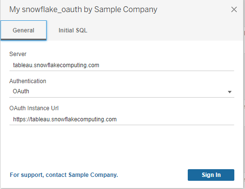

# Readme

This sample connector demonstrates how to add OAuth Authentication type to Snowflake datasource.  This sample connector has been tested for all the authentication methods listed here with all platforms (Mac Desktop, Windows Desktop and Server, Linux Server). You can use this as an example for how to add OAuth to your own connector. 
For Under Development connetor, refer to this page on how to enable it locally: https://tableau.github.io/connector-plugin-sdk/docs/share.

## <a id="purpose"/> Use case(s) of this connector plugin
1. Use **OAuth** authentication to connect to Snowflake with `Tableau Desktop on Windows`/`Tableau Desktop on Mac`. See [OAuth for Tableau Desktop](#desktop)    
1. Publish a viz from `Tableau Desktop` using **Prompt** and open it in Tableau Server. See [OAuth for Tableau Server](#server)
1. Publish a viz from `Tableau Desktop` using **Embed [your_username]** and open it in Tableau Server. See [OAuth for Tableau Server](#server)


## <a id="component"></a>OAuth Component explanation

Tableau Desktop oauth-service which is a separate service to handle OAuth flows, there are multiple places need to be configured:
**manigest.xml**

Your manifest.xml file needs to include a new file which is oauthConfig.xml.
```
 <oauth-config file='oauthConfig.xml'/>
```
**connectionFields.xml**

For connectionFields.xml, be sure to name value for oauth option as "oauth", case sensitive.  

```
<field name="authentication" label="Authentication" category="authentication" value-type="selection" default-value="auth-user-pass" >
  <selection-group>
    <option value="auth-user-pass" label="Username and Password"/>
    <option value="oauth" label="OAuth"/>
  </selection-group>
</field>
```
**connectionBuilder.js**

For connectionBuilder.js, you need to use your DB sepcific logic to handle how to pass in OAuth attributes. For Snowflake it's like this:
```
 else if(authAttrValue == "oauth")
    {
        params["AUTHENTICATOR"] = "OAUTH";
        params["TOKEN"] = attr["ACCESSTOKEN"];
    }

```
**oauthConfig.xml**

The oauthConfig file holds oAuth related attrs about this connector, they must be provided upon registration so the oauth-service know how to invoke the oauth flow.
```
<?xml version="1.0" encoding="utf-8"?>
<pluginOAuthConfig>
    <!-- dbclass must correspond to the dbclass registered in manifest.xml --> 
    <dbclass>snowflake_oauth</dbclass>
    <!-- Subsitute these with your OAuth Client Id and Client Secret -->
    <clientIdDesktop>[your_client_id]</clientIdDesktop>
    <clientSecretDesktop>[your_client_secret]</clientSecretDesktop>
    <-- Desktop redirectUri, subsitute for your own registered desktop redirectUri --> 
    <redirectUrisDesktop>http://localhost:55555/Callback</redirectUrisDesktop>
    <!-- authUri and tokenUri only contains the path since it has CAP_SUPPORTS_CUSTOM_DOMAIN on, so the final oauth endpoint will be 
    your input instanceUrl + authUri/tokenUri -->
    <authUri>/oauth/authorize</authUri>
    <tokenUri>/oauth/token-request</tokenUri>
    <!-- Used to prevent malicious instanceUrl, your instanceUrl must match this regular expression or OAuth flow will abort -->
    <instanceUrlValidationRegex>^https:\/\/(.+\.)?(snowflakecomputing\.(com|us|cn|de))(.*)</instanceUrlValidationRegex>
    <!-- Snowflake need refresh_token scope to issue refresh tokens -->
    <scopes>refresh_token</scopes>
    <!-- Snowflake supports PKCE, Cutom domain, fixed callback url -->
    <capabilities>
        <entry>
            <key>CAP_PKCE_REQUIRES_CODE_CHALLENGE_METHOD</key>
            <value>true</value>
        </entry>
        <entry>
            <key>CAP_SUPPORTS_CUSTOM_DOMAIN</key>
            <value>true</value>
        </entry>
        <entry>
            <key>CAP_REQUIRE_PKCE</key>
            <value>true</value>
        </entry>
        <entry>
            <key>CAP_FIXED_PORT_IN_CALLBACK_URL</key>
            <value>true</value>
        </entry>
        <entry>
            <key>CAP_PKCE_REQUIRES_CODE_CHALLENGE_METHOD</key>
            <value>true</value>
        </entry>
    </capabilities>
    <!-- Map Tableau recognized attr <key> to Snowflake OAuth response attr <value> -->
    <accessTokenResponseMaps>
        <entry>
            <key>ACCESSTOKEN</key>
            <value>access_token</value>
        </entry>
        <entry>
            <key>REFRESHTOKEN</key>
            <value>refresh_token</value>
        </entry>
        <entry>
            <key>access-token-issue-time</key>
            <value>issued_at</value>
        </entry>
        <entry>
            <key>access-token-expires-in</key>
            <value>expires_in</value>
        </entry>
        <entry>
            <key>username</key>
            <value>username</value>
        </entry>
    </accessTokenResponseMaps>
    <!-- No refreshTokenResponseMaps needed since that's same with the accessTokenResponseMaps -->
 </pluginOAuthConfig>

```

## <a id="desktop"></a>OAuth on Tableau Desktop

Your Desktop sign in Dialog will look like this, you can choose different auth mode and notice different required fields appear.



By clicking the sign in button, you will be directed to your OAuth Provider's sign in Url in a default browser on your machine where you can input your credentials, Tableau will get the required attrs back and upon complete you will see this screen:


## <a id="server"/> OAuth on Tableau Server

Config your OAuth client on your server: This would be the first step you need to perform for enabling OAuth on Tableau Server, this will setup OAuth Client information to be used on Tableau Server, e.g.:
```
tsm configuration set -k oauth.config.clients -v "[{\"oauth.config.id\":\"snowflake_oauth\", \"oauth.config.client_id\":\"[your_client_id]\", \"oauth.config.client_secret\":\"[your_client_secret]\", \"oauth.config.redirect_uri\":\"[your_redirect_url]\"}]" --force-keys
```
You need to subsitute [your_client_id], [your_client_secret], [your_redirect_url] with the ones you registered in your provider's OAuth registration page.
[your_redirect_url] needs to follow certain format, if your server address is https://Myserver/ then [your_reirect_uri] needs to be https://Myserver/auth/add_oauth_token.

To add an OAuth credential on Tableau Server, you will go to **My Account Settings** page, look for your class in the **Saved Credentals For DataSources** Section.
After successfully added your credential you will notice an entry appear under your class.


When publishing a pluggable OAuth Workbook/DataSource to Tableau Server, you wil see multiple auth options:
**propmt** means this resource will published without embedding credential, viewers would need to provide credential to access the resource.
**embedding [your_username]** means you will embed the credential with username **[your_username]** to this resource, so all the viewer can use the same credential **[ABC]** to access the resource. Note in order for this to show up, you must already have added a saved OAuth credential according to previous section. You would see multiple entries if you have multiple records of saved credentials and you can pick which one you wanna use for embedding. 
**embed Password** is no longer a supported auth mechanism for Pluggable OAuth connectors and an error will show up if you choose that option.


For Web Create, the UI dialog would be same with Tableau Desktop with the difference that we are using the server OAuth Client configs.
